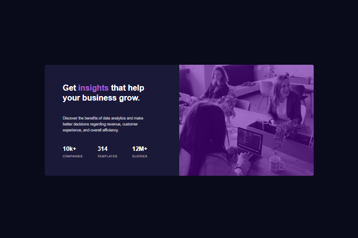

# Frontend Mentor - Stats preview card component solution

This is a solution to the [Stats preview card component challenge on Frontend Mentor](https://www.frontendmentor.io/challenges/stats-preview-card-component-8JqbgoU62). Frontend Mentor challenges help you improve your coding skills by building realistic projects. 

## Table of contents

- [Overview](#overview)
  - [The challenge](#the-challenge)
  - [Screenshot](#screenshot)
  - [Links](#links)
- [My process](#my-process)
  - [Built with](#built-with)
  - [What I learned](#what-i-learned)
  - [Continued development](#continued-development)
- [Author](#author)

## Overview

### The challenge

Users should be able to:

- View the optimal layout depending on their device's screen size

### Screenshot



### Links

- Live Site URL: [https://tascate.github.io/stats-card-challenge/](https://tascate.github.io/stats-card-challenge/)

## My process

### Built with

- Semantic HTML5 markup
- CSS custom properties
- Flexbox
- CSS Grid

### What I learned

Learned how to utilize Flexbox to align the elements of a card to the specified design. This includes the card header, description and statstics in align by column and row. Also learned how to create an overlay effect on an image through a div wrap on an image and using a transparent background color fill.

Using this CSS snippet to produce the color overlay effect on the black and white image.
```css
.purple_wrap:before {
    content: "";
    background: hsla(277, 64%, 61%, 0.55);
    filter: brightness(55%) saturate(145%) contrast(170%);
    position: absolute;
    height: 100%;
    width: 100%;
}
```

### Continued development

In future projects, I want to refine how quickly I can align content to the specified design. There were some moments where I was figuring out how to accomplish this. Ideally, I would be able to quickly achieve the specified design with minimal searching on what to do.

## Author

- Frontend Mentor - [@Tascate](https://www.frontendmentor.io/profile/Tascate)
